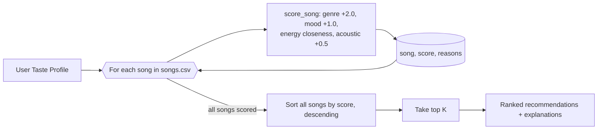

# 🎵 Music Recommender Simulation

## Project Summary

In this project you will build and explain a small music recommender system.

Your goal is to:

- Represent songs and a user "taste profile" as data
- Design a scoring rule that turns that data into recommendations
- Evaluate what your system gets right and wrong
- Reflect on how this mirrors real world AI recommenders

This version, **VibeMatch 1.0**, is a CLI-first, content-based recommender.
It loads an 18-song catalog from `data/songs.csv`, scores every song against
a user's genre/mood/energy/acousticness preferences using a weighted recipe
(see below), and prints a ranked, explained top-k list to the terminal —
no external APIs, no user accounts, just data in and a ranked list out.

---

## How The System Works

### How real recommenders work

Platforms like Spotify and YouTube mainly blend two strategies. **Collaborative
filtering** looks at *other users' behavior* — "people who liked what you liked
also played this" — using signals like likes, skips, replays, and shared
playlists. **Content-based filtering** looks at the *song's own attributes* —
genre, mood, tempo, energy — and recommends songs that resemble the ones you
already enjoy. Real systems combine both at huge scale, but they share the same
core idea: turn taste and songs into numbers, score how well each song matches,
then rank the results.

### What my version prioritizes

My simulator is a small **content-based** recommender. It has no user history and
no other users, so it works purely from a user's stated taste profile and each
song's attributes. It prioritizes matching the **vibe** of a song to the user: the
right *genre* and *mood* first, then how close the song's *energy* is to what the
user wants, and whether it fits their preference for acoustic vs produced sound.
Every recommendation also comes with a short reason, so the ranking is
transparent rather than a black box.

### Features each `Song` uses

From `data/songs.csv`, each `Song` carries these attributes (my scorer uses the
four in **bold**):

- **`genre`** — pop, lofi, rock, jazz, etc. (categorical identity signal)
- **`mood`** — happy, chill, intense, relaxed… (the finer "vibe")
- **`energy`** — 0.0–1.0 intensity (numeric, scored by closeness)
- **`acousticness`** — 0.0–1.0 acoustic vs produced (numeric)
- `tempo_bpm`, `valence`, `danceability` — available in the data but not scored
  yet (reserved for a later experiment)
- `id`, `title`, `artist` — identity / display only

### What my `UserProfile` stores

- `favorite_genre` — the genre the user most wants to hear
- `favorite_mood` — their preferred mood
- `target_energy` — the energy level they're aiming for (0.0–1.0)
- `likes_acoustic` — whether they prefer acoustic-leaning songs

### Example user profiles (planning check)

To sanity-check that four fields are enough to tell tastes apart, I planned
against two deliberately opposite profiles instead of just one:

```python
rock_fan = {"favorite_genre": "rock", "favorite_mood": "intense", "target_energy": 0.9, "likes_acoustic": False}
lofi_fan = {"favorite_genre": "lofi", "favorite_mood": "chill",   "target_energy": 0.35, "likes_acoustic": True}
```

**Critique (asked my AI assistant to check this):** these two differ on every
field, so they're an easy case — "Storm Runner" (rock/intense/0.91/low
acousticness) scores high for `rock_fan` and near zero for `lofi_fan`, and
vice versa for "Midnight Coding" (lofi/chill/0.42/high acousticness). The
harder case is two profiles that share a genre but differ in mood/energy —
e.g. `chill electronic` vs. `intense electronic`. Because genre is weighted
2x higher than mood (see recipe below), a genre match can partially mask a
mood mismatch for same-genre songs. That's a known limitation, not a bug —
noted under biases below.

### Algorithm recipe (finalized)

Each song is scored against the user profile by summing:

| Signal | Rule | Points |
|---|---|---|
| Genre match | `song.genre == favorite_genre` | **+2.0** |
| Mood match | `song.mood == favorite_mood` | **+1.0** |
| Energy closeness | `1 - abs(target_energy - song.energy)` | **0 – 1.0** (continuous) |
| Acoustic fit | `likes_acoustic` agrees with `song.acousticness` (>0.5 counts as acoustic) | **+0.5** |

Max possible score ≈ 4.5. Genre is weighted highest because it's the
coarsest, most reliable taste signal; mood and energy refine within a genre;
the acoustic bonus is a smaller tiebreaker.

**Ranking rule:** score every song in the catalog with the rule above, sort
descending by score, return the top *k*, and pair each with a one-line
explanation naming which signals matched.

**Biases I expect:** because genre outweighs mood 2:1, the system will tend
to over-prioritize genre — a same-genre/wrong-mood song can outrank a
right-mood song from a neighboring genre. It may also underrate songs whose
best match is on an unscored feature (`tempo_bpm`, `valence`,
`danceability`), and it has no idea about anything outside these four
numbers, so genuinely novel or cross-genre songs a user might love will never
surface.

### Data flow (planning sketch)



---

## Getting Started

### Setup

1. Create a virtual environment (optional but recommended):

   ```bash
   python -m venv .venv
   source .venv/bin/activate      # Mac or Linux
   .venv\Scripts\activate         # Windows

2. Install dependencies

```bash
pip install -r requirements.txt
```

3. Run the app:

```bash
python -m src.main
```

### Running Tests

Run the starter tests with:

```bash
pytest
```

You can add more tests in `tests/test_recommender.py`.

---

## Sample Recommendation Output

```
$ python -m src.main
Loaded songs: 18

=== High-Energy Pop ===
user_prefs = {'genre': 'pop', 'mood': 'happy', 'energy': 0.85, 'likes_acoustic': False}

Sunrise City - Score: 4.47
Because: genre match (+2.0), mood match (+1.0), energy closeness (+0.97), acoustic fit (+0.5)

Gym Hero - Score: 3.42
Because: genre match (+2.0), energy closeness (+0.92), acoustic fit (+0.5)
```

`src/main.py` runs six profiles (3 everyday tastes + 3 adversarial edge
cases) each time it's invoked. Full output for all six, plus analysis of
each result, is in [`model_card.md` §7 Evaluation](model_card.md#7-evaluation).

**Screenshot or video** *(optional)*: <!-- Insert a screenshot or demo video link here -->

---

## Experiments You Tried

**Weight shift — halved genre (2.0 → 1.0), doubled energy (`*2`):** reran the
`High-Energy Pop` profile. "Get Lucky" (mood match, disco) overtook "Gym
Hero" (genre match only, pop) — more accurate to my intuition for that
profile. But the same change made the "Sad but High-Energy" adversarial
profile drop its only genre-matched song from the top 5 entirely, since
genre could no longer compensate for a large energy mismatch. Net: the
change traded one bias (genre dominance) for another (energy dominance)
rather than removing bias — so I reverted to the original 2.0/1.0 weights.
Full before/after numbers are in
[`model_card.md` §7](model_card.md#7-evaluation).

- Feature removal (mood) and adding tempo/valence to the score are ideas for
  future experiments — not yet tried.
- See how the system behaved for different user types in the profile
  comparisons in `model_card.md`.

---

## Limitations and Risks

- It only works on a tiny, 18-song catalog — most genres have just one song.
- It does not understand lyrics, language, or anything outside the tagged
  numeric/categorical features.
- It over-favors genre (worth 2x a mood match), which can rank a
  wrong-mood song from the right genre above a right-mood song from a
  neighboring genre.
- Mood matching is an exact string comparison, so near-synonyms
  (`"sad"` vs. `"melancholy"`) don't match at all.
- It has no user history, so it can't tell "the user hasn't tried this
  genre" from "the user would hate this genre."

See [`model_card.md`](model_card.md) for the full evaluation and testing
behind these findings.

---

## Reflection

Read and complete `model_card.md`:

[**Model Card**](model_card.md)

Building this made concrete something I only understood abstractly before:
a recommendation is just a sorted list of numbers, and every number comes
from a handful of weighted rules someone chose. Turning "genre, mood,
energy, acousticness" into "+2.0, +1.0, closeness score, +0.5" and then
sorting is the entire trick — there's no hidden intelligence deciding "Gym
Hero" belongs in a happy-pop list, just arithmetic that happened to favor
genre over mood because I weighted it that way. Predictions are only as
good, and only as fair, as the features you chose to measure and the
numbers you chose to weight them by.

Bias showed up faster than I expected, and not from anything malicious —
just from genre being both the most common tag *and* the highest-weighted
one, so it quietly dominated results, and from exact-string mood matching
silently dropping near-synonyms. Real platforms have the same shape of
problem at a much bigger scale: if "engagement" or "genre" is weighted too
heavily relative to other signals, or if training data underrepresents
certain artists or moods, the system doesn't need bad intentions to produce
a filter bubble — it just needs one feature to be worth more than it should
be, same as my `+2.0` did here.
